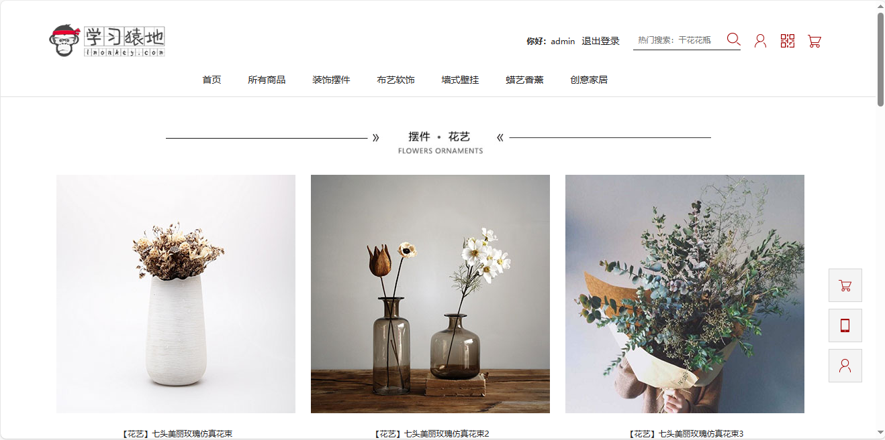
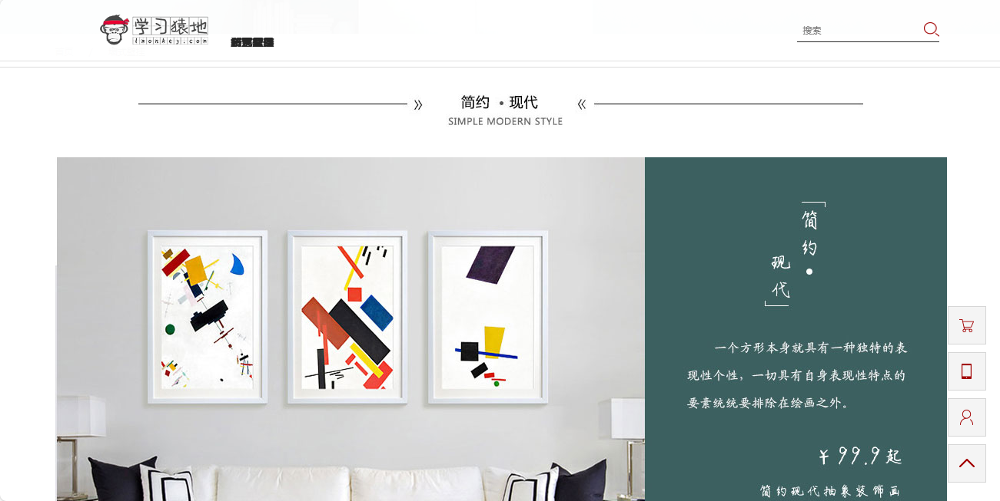
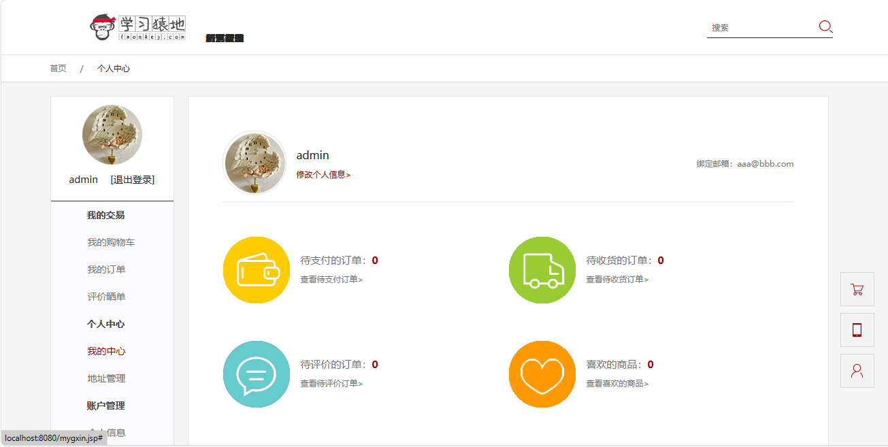
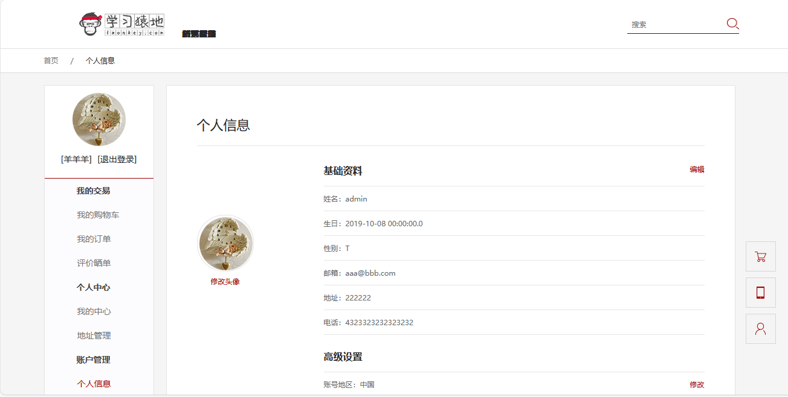
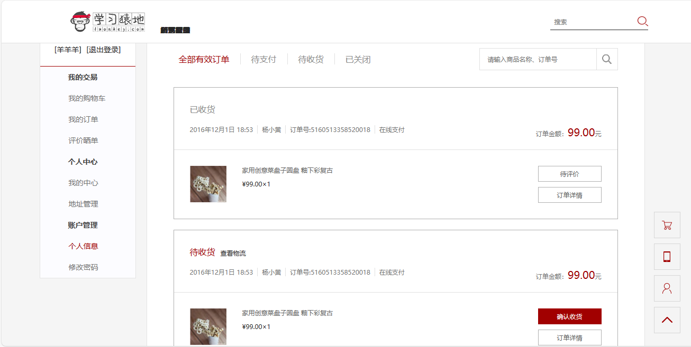
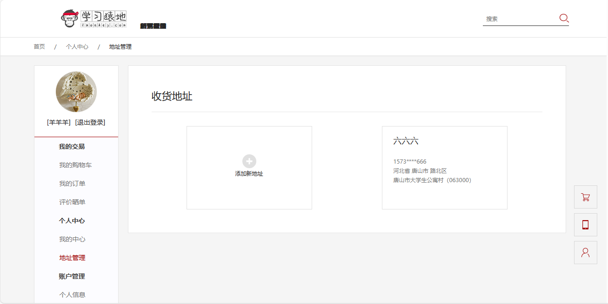

<h1 align="center">29.基于servlet+jsp的居家花瓶摆件商城系统</h1>

 获取sql文件 QQ: 386869957 QQ群: 377586148 

 [推荐站点: 从戎源码网](https://armycodes.com/) 

## 简介

> 本代码来源于网络,仅供学习参考使用!
>
> 提供1.远程部署/2.修改代码/3.设计文档指导/4.框架代码讲解等服务
>
> 首页地址: http://localhost:8080/
> 
> 登录地址：http://localhost:8080/login.jsp
> 
> 用户名密码：admin 123

## 项目介绍

基于servlet+jsp的居家花瓶摆件商城系统：前端 jsp、jquery，后端 servlet，花瓶摆件商品浏览，添加购物车，支付，后台查看订单和地址管理等。

## 主要功能

- 基本功能：登录、注册、退出、个人信息查看、修改个人信、密码修改
- 首页：商品列表展示、装饰摆件、布艺软饰、墙饰壁挂、蜡艺香薰、创意家居
- 订单：购物车、订单列表、订单详情查看、确认收货、立即支付、评价、评价晒单
- 收货地址：收货地址列表、添加收货地址

## 环境

- <b>IntelliJ IDEA 2009.3</b>

- <b>Mysql 5.7.26</b>

- <b>Tomcat 7.0.73</b>

- <b>JDK 1.8</b>

## 运行截图

